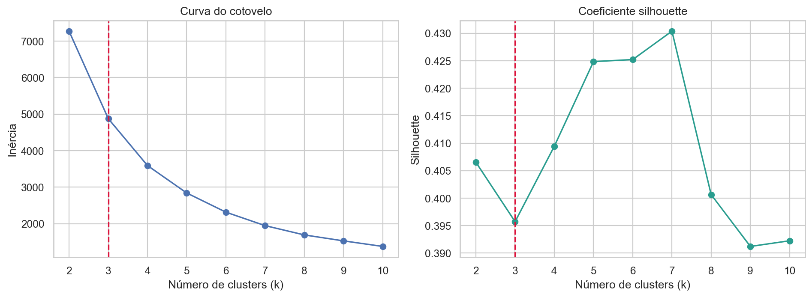
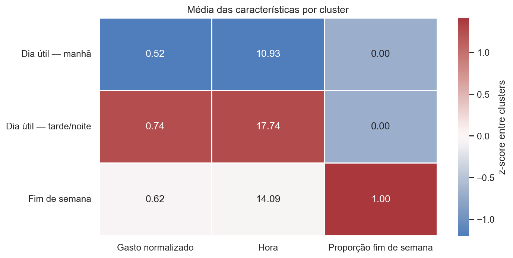
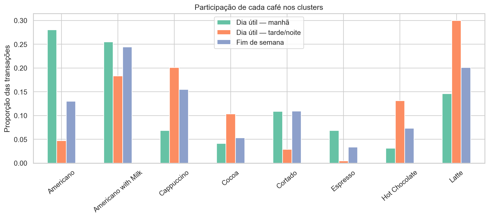
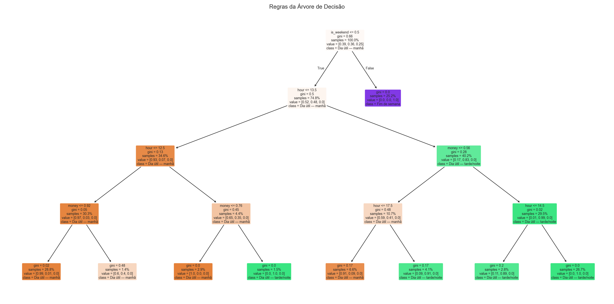

# Segmentação e classificação de vendas de uma cafeteria

Este projeto analisa **3.636 transações** de uma cafeteria, registradas entre **1º de março de 2024 e 23 de março de 2025**. O trabalho combina:

1. preparação e normalização dos dados;
2. aprendizado não supervisionado com K-Means;
3. aprendizado supervisionado com Árvore de Decisão.

O objetivo da etapa não supervisionada é identificar padrões de compra sem rótulos prévios. Em seguida, a etapa supervisionada aprende regras capazes de classificar novas transações nos clusters encontrados.

## Dataset

Os dados foram obtidos do projeto público [Coffee Shop Business Intelligence](https://github.com/mehmetkahya0/coffee-shop-business-intelligence). O repositório mantém dois arquivos de origem:

- `01_original.csv`: exportação utilizada no início do projeto;
- `ref_full_datetime.csv`: referência da mesma fonte com o horário completo.

A referência foi necessária porque o Excel transformou a coluna `datetime` do primeiro arquivo em `mm:ss.0`, removendo a hora. Antes da recuperação, o notebook confirma que ambos os arquivos possuem as mesmas 3.636 linhas, na mesma ordem, e os mesmos valores de data, forma de pagamento, cartão, valor e produto.

| Coluna original | Descrição |
|---|---|
| `date` | data da venda |
| `datetime` | data e horário completos na referência |
| `cash_type` | pagamento por cartão ou dinheiro |
| `card` | identificador anonimizado do cartão |
| `money` | valor da compra |
| `coffee_name` | produto comprado |

Existem **89 valores ausentes em `card`**, correspondentes aos pagamentos em dinheiro. Como o identificador do cartão não participa dos modelos, essas ausências não exigem imputação.

## Preparação e características

O notebook `01_normalize.ipynb` gera `02_normalized.csv` com 3.636 linhas, 14 características numéricas e nenhum valor ausente.

| Característica | Preparação | Uso posterior |
|---|---|---|
| `money` | min-max: `(x - mínimo) / (máximo - mínimo)` | K-Means e Árvore de Decisão |
| `hour` | hora recuperada de `ref_full_datetime.csv` | K-Means e Árvore de Decisão |
| `is_weekend` | 1 para sábado/domingo; 0 nos demais dias | K-Means e Árvore de Decisão |
| `weekday` | segunda = 0 até domingo = 6 | descrição, não entra nos modelos finais |
| `day_period` | madrugada = 0, manhã = 1, tarde = 2, noite = 3 | descrição, não entra nos modelos finais |
| `cash_type` | cartão = 0; dinheiro = 1 | descrição, não entra nos modelos finais |
| `coffee_name_*` | codificação one-hot dos oito produtos | interpretação dos clusters |

Cada linha possui exatamente uma categoria `coffee_name_*` igual a 1.

Há duas transformações de escala distintas:

- **normalização min-max:** aplicada a `money` durante a preparação, colocando o valor no intervalo `[0, 1]`;
- **padronização:** aplicada com `StandardScaler` às três entradas do K-Means. Cada característica passa a ter média 0 e desvio-padrão 1, evitando que sua unidade determine a distância euclidiana.

## Aprendizado não supervisionado

O K-Means utiliza `money`, `hour` e `is_weekend`. Essa seleção evita representar duas vezes a mesma informação:

- `weekday` repete parcialmente o indicador `is_weekend`;
- `day_period` deriva diretamente de `hour`;
- `cash_type` possui somente 89 pagamentos em dinheiro e poderia criar um cluster baseado apenas nessa categoria rara;
- as colunas de produto fariam o algoritmo separar principalmente os tipos de café.

Foram avaliados valores de `k` entre 2 e 10. A curva do cotovelo e o silhouette são usados em conjunto, e `k = 3` foi escolhido por equilibrar redução da inércia e interpretação dos padrões. O silhouette não atinge seu máximo em `k = 3`; portanto, a escolha também considera a utilidade e a simplicidade dos três perfis.



Os clusters resultantes são:

| Cluster | Transações | Proporção | Gasto normalizado médio | Hora média |
|---|---:|---:|---:|---:|
| Dia útil — manhã | 1.416 | 38,9% | 0,52 | 10,93 |
| Dia útil — tarde/noite | 1.304 | 35,9% | 0,74 | 17,74 |
| Fim de semana | 916 | 25,2% | 0,62 | 14,09 |

O heatmap colore as médias por z-score entre clusters, mas anota os valores nas unidades originais para facilitar a interpretação.



Os tipos de café foram analisados somente depois do agrupamento. Assim, a composição dos produtos ajuda a descrever os clusters sem influenciar sua criação.



## Aprendizado supervisionado

O arquivo `03_clustered.csv` fornece os rótulos produzidos pelo K-Means. Uma Árvore de Decisão de profundidade máxima 4 aprende a prever `cluster_name` usando as mesmas três características.

O conjunto foi dividido de forma estratificada e reproduzível:

- treino: **2.908 transações (80%)**;
- teste: **728 transações (20%)**;
- semente aleatória: **42**.

| Modelo/métrica | Acurácia |
|---|---:|
| Dummy, classe mais frequente — teste | 39,011% |
| Árvore de Decisão — treino | **97,868%** |
| Árvore de Decisão — teste | **97,390%** |

A proximidade entre as acurácias de treino e teste indica que a árvore manteve desempenho semelhante em dados não usados no ajuste. No teste, foram classificadas corretamente **709 de 728 transações**.


A árvore abaixo torna explícitas as regras aprendidas. A primeira separação identifica fins de semana; as demais combinam principalmente limites de horário e valor.



## Limitação da classificação

O alvo supervisionado não é uma classe observada originalmente. Ele foi criado pelo K-Means a partir das mesmas três características usadas pela árvore. Portanto, a acurácia demonstra que o modelo consegue **reproduzir as regras de atribuição dos clusters em novas transações**, mas não prova que ele prevê uma preferência real, fidelidade do cliente ou comportamento futuro independente.

## Arquivos gerados

| Arquivo | Conteúdo |
|---|---|
| `02_normalized.csv` | 14 características preparadas para 3.636 transações |
| `03_clustered.csv` | características normalizadas mais `cluster` e `cluster_name` |
| `04_predictions.csv` | `money`, `hour`, `is_weekend`, classe real, classe prevista e indicador de acerto para as 728 linhas de teste |

## Como reproduzir

Com Python 3 instalado, crie um ambiente virtual e instale as versões utilizadas:

```powershell
python -m venv .venv
.venv\Scripts\Activate.ps1
python -m pip install -r requirements.txt
```

Execute toda a sequência automaticamente:

```powershell
python run_pipeline.py
```

O script reinicia e executa os notebooks nesta ordem:

1. `01_normalize.ipynb` — gera `02_normalized.csv`;
2. `02_clustering.ipynb` — gera `03_clustered.csv` e as figuras de clustering;
3. `03_supervised.ipynb` — gera `04_predictions.csv` e as figuras supervisionadas.

## Conclusão

O K-Means encontrou três padrões interpretáveis associados ao período da semana, horário e valor da compra. A Árvore de Decisão aprendeu uma aproximação compacta dessas regras e alcançou 97,390% de acurácia em transações separadas para teste. O projeto atende às etapas de descrição do dataset, especificação das características, explicação da padronização, curva do cotovelo, heatmap das médias e comparação das acurácias de treino e teste.
