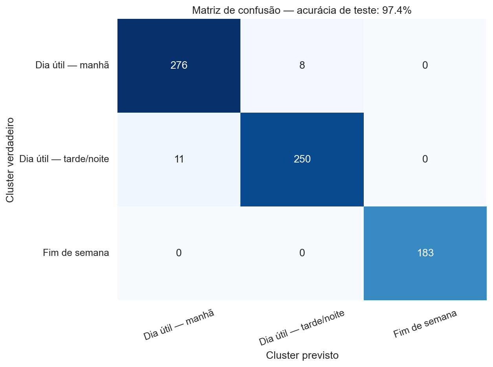

# Segmentação e classificação de vendas de uma cafeteria

## Objetivo

Este projeto analisa **3.636 transações** de uma cafeteria, registradas entre março de 2024 e março de 2025.

Foram aplicadas duas técnicas de aprendizado de máquina:

- **K-Means**, para encontrar grupos de transações semelhantes;
- **Árvore de Decisão**, para aprender a classificar novas transações nesses grupos.

## Dataset e preparação

O dataset original contém as seguintes informações:

| Coluna | Descrição |
|---|---|
| `date` | data da venda |
| `datetime` | data e horário da venda |
| `cash_type` | forma de pagamento |
| `card` | identificador anonimizado do cartão |
| `money` | valor da compra |
| `coffee_name` | produto comprado |

As características preparadas foram:

| Característica | Transformação |
|---|---|
| `money` | normalização min-max para o intervalo de 0 a 1 |
| `hour` | hora da transação |
| `is_weekend` | 1 para sábado ou domingo e 0 para dias úteis |
| `weekday` | número do dia da semana |
| `day_period` | manhã, tarde ou noite representadas numericamente |
| `cash_type` | cartão = 0 e dinheiro = 1 |
| `coffee_name_*` | codificação one-hot dos produtos |

Para o K-Means foram utilizadas somente `money`, `hour` e `is_weekend`. Antes do treinamento, essas três características foram padronizadas com `StandardScaler`, ficando com média 0 e desvio-padrão 1.

## Aprendizado não supervisionado

O número de clusters foi avaliado entre 2 e 10. A curva do cotovelo, o coeficiente silhouette e a interpretação dos resultados foram usados para escolher **k = 3**.

Os grupos encontrados foram:

| Cluster | Transações | Características principais |
|---|---:|---|
| Dia útil — manhã | 1.416 | compras em dias úteis, por volta das 11h |
| Dia útil — tarde/noite | 1.304 | compras em dias úteis, por volta das 18h, com maior gasto médio |
| Fim de semana | 916 | compras realizadas aos sábados e domingos |

O heatmap apresenta a média das características utilizadas em cada cluster.

## Aprendizado supervisionado

Uma Árvore de Decisão com profundidade máxima 4 foi treinada para classificar novas transações nos clusters encontrados pelo K-Means.

O dataset foi separado de forma estratificada em:

- **2.908 transações para treino (80%)**;
- **728 transações para teste (20%)**.

| Avaliação | Acurácia |
|---|---:|
| Modelo Dummy no teste | 39,011% |
| Árvore de Decisão no treino | **97,868%** |
| Árvore de Decisão no teste | **97,390%** |

A proximidade entre as acurácias de treino e teste indica que o modelo manteve bom desempenho em transações que não participaram do treinamento. No teste, foram classificadas corretamente **709 de 728 transações**.

A árvore mostra as regras aprendidas a partir do valor da compra, do horário e da identificação de fim de semana.

## Conclusão

O K-Means identificou três padrões de compra relacionados ao dia da semana, ao horário e ao valor da transação. A Árvore de Decisão aprendeu a reproduzir essa classificação e alcançou **97,390% de acurácia no conjunto de teste**.
